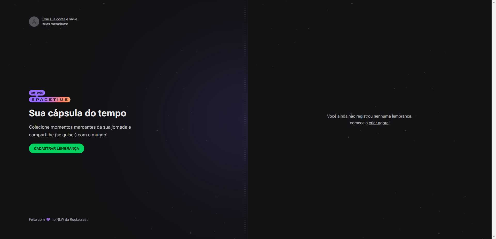

<h1 align="center">Cápsula do Tempo</h1>

Criado no bootcamp NLW Spacetime promovido pela Rocketseat para ensino de tecnologias WEB.  

  <a href="#-tecnologias">Tecnologias</a>&nbsp;&nbsp;&nbsp;|&nbsp;&nbsp;&nbsp;
  <a href="#-projeto">Projeto</a>&nbsp;&nbsp;&nbsp;|&nbsp;&nbsp;&nbsp;
  <a href="#memo-licença">Licença</a>

  

 

  

## 🚀 Tecnologias

Esse projeto foi desenvolvido com as seguintes tecnologias:

- ReactJS
- NextJS
- TypeScript
- Fastify
- Tailwind
- React Native
- Prisma
- Postgree
- SQLite
- NodeJS
- Git e Github
- Figma

## 💻 Projeto

A cápsula do tempo é sistema para gravar momentos importantes e compartilhá-los com quem ama ❤️.

- [Acesse o projeto finalizado, online](https://rocketseat-nlw-spacetime.vercel.app/)

## :memo: Licença

Esse projeto está sob a licença MIT.

---